```{r setup, include=FALSE}
knitr::opts_chunk$set(echo = TRUE, collapse = TRUE, cache = TRUE, fig.show = 'hold', fig.align = 'center')
```

<!-- %%%%%%%%%%%%%%%%%%%%%%%%%%%%%%%%%%%%%%%%%%%%%%%%%%%%%%%%%%%%%%%%%%%% -->

## Motivation {auto-animate="true"}

In the core facility proteomics we perform protein identification, quantification and characterization of proteins, peptides, and post-translational modifications (PTMs).

-   sample origin

    -   cell lysates
    -   supernatant
    -   extracellular vesicles
    -   IP...

-   approach

    -   label-free with DIA for standard samples

    -   TMT-labeling for phosphoproteomics and other modifications

<!-- %%%%%%%%%%%%%%%%%%%%%%%%%%%%%%%%%%%%%%%%%%%%%%%%%%%%%%%%%%%%%%%%%%%% -->

## Proteomic experiment {auto-animate="true"}

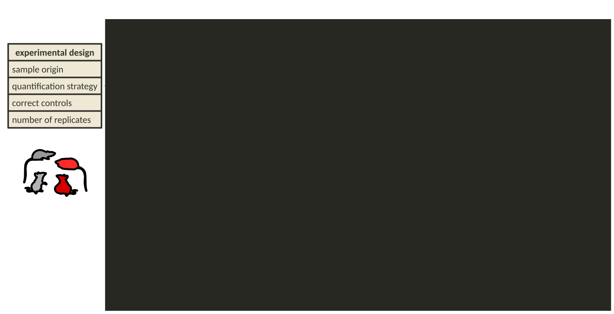{fig-align="center"}

## Proteomic experiment

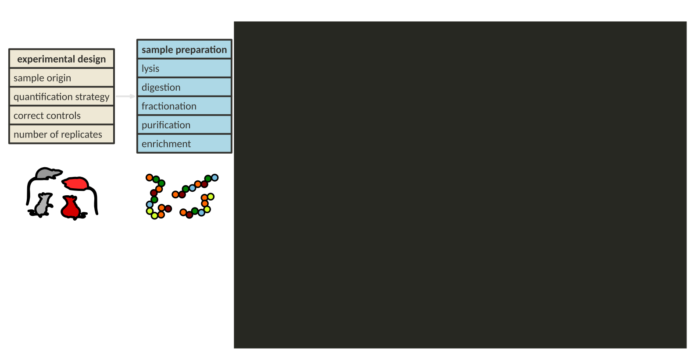{fig-align="center"}

## Proteomic experiment

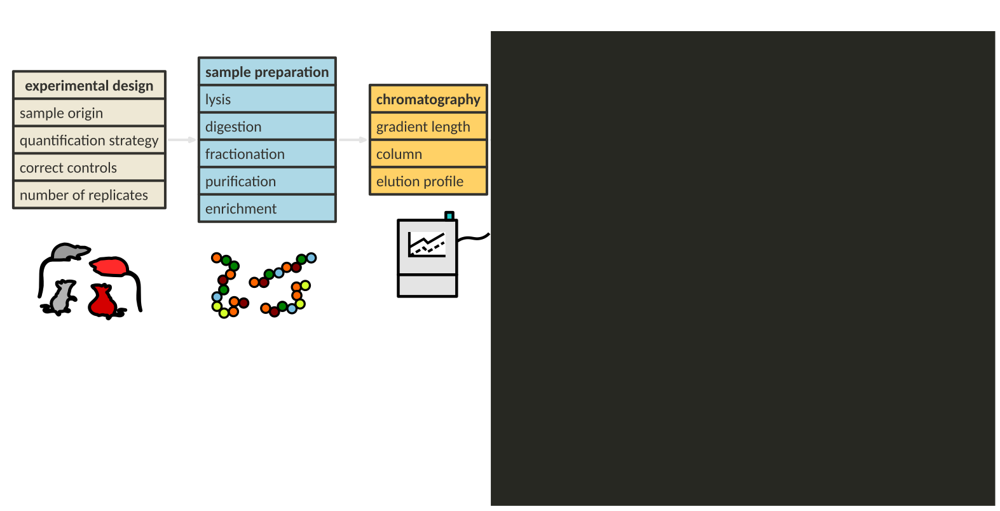{fig-align="center"}

## Proteomic experiment

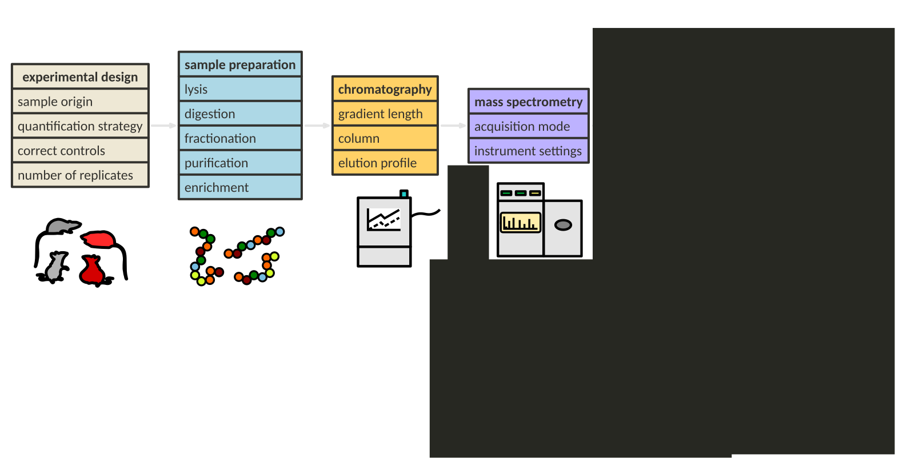{fig-align="center"}

## Proteomic experiment

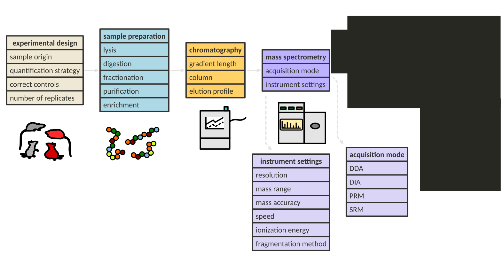{fig-align="center"}

## Proteomic experiment

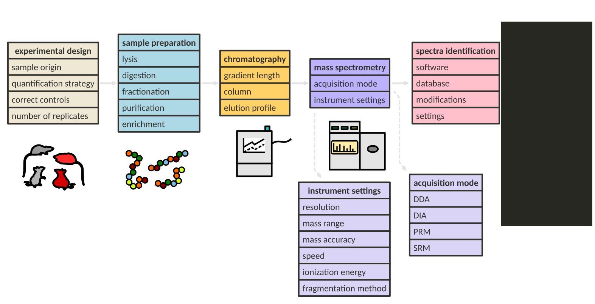{fig-align="center"}

## Proteomic experiment

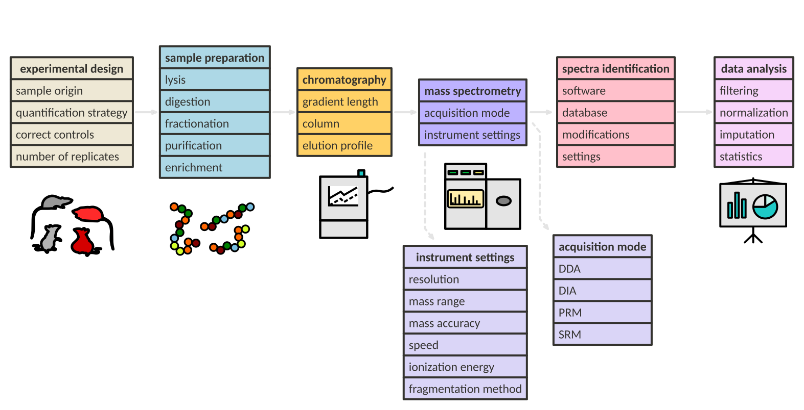{fig-align="center"}

## Proteomic experiment

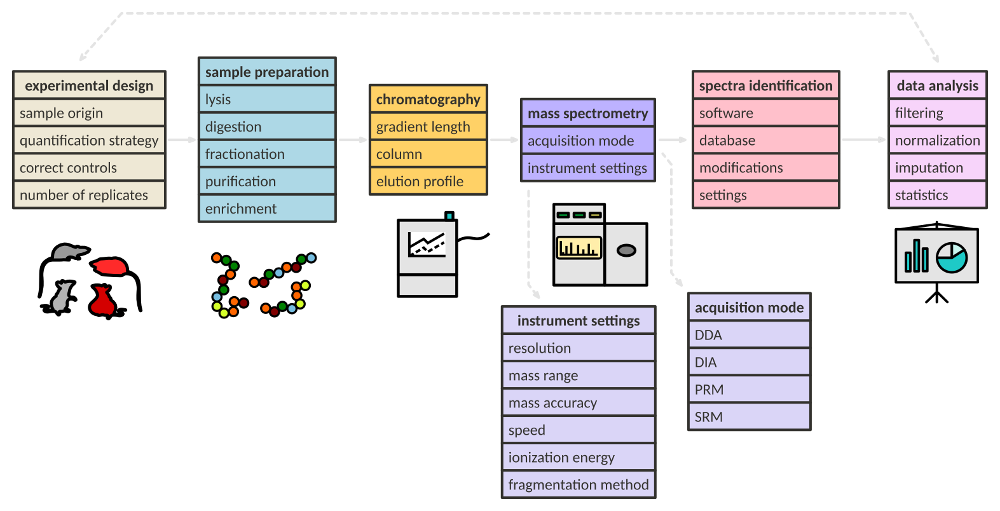{fig-align="center"}

<!-- %%%%%%%%%%%%%%%%%%%%%%%%%%%%%%%%%%%%%%%%%%%%%%%%%%%%%%%%%%%%%%%%%%%% -->

## Sample complexity {auto-animate="true"}

Chromatogram of one of the IP samples that were a subject of your previous exercise.

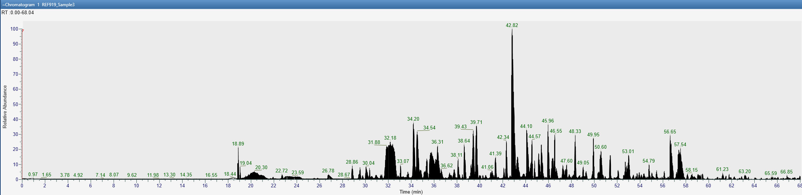{fig-align="center"}

## Sample complexity {auto-animate="true"}

{width="50%"}

Chromatogram of a typical human complex sample.

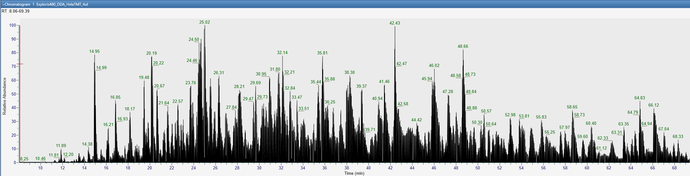{fig-align="center"}

## Sample complexity {auto-animate="true"}

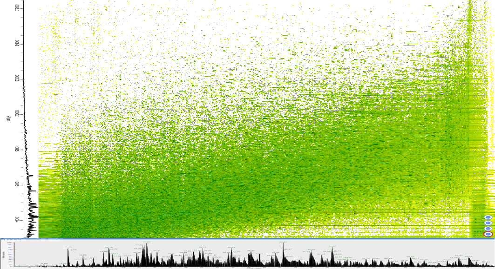{width="100%" fig-align="center"}

## Sample complexity {auto-animate="true"}

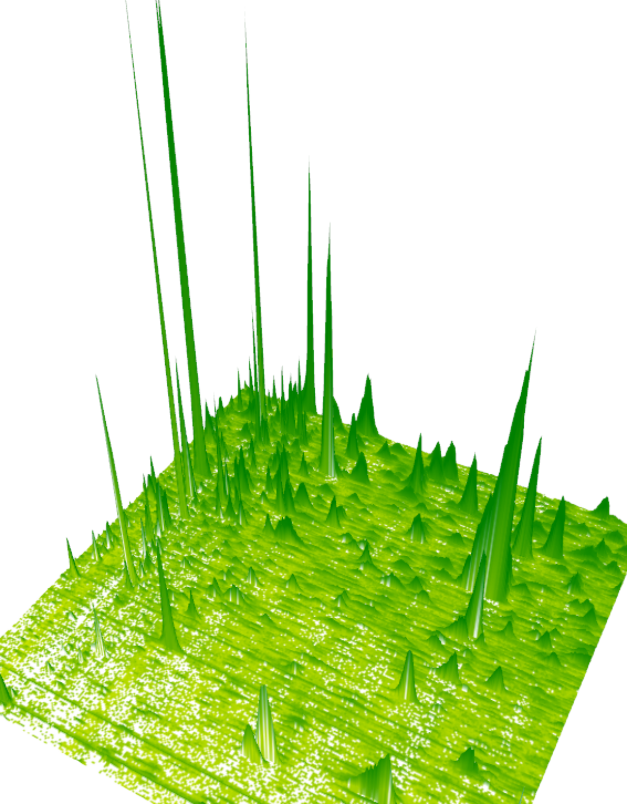{fig-align="center"}

## Sample complexity {auto-animate="true"}

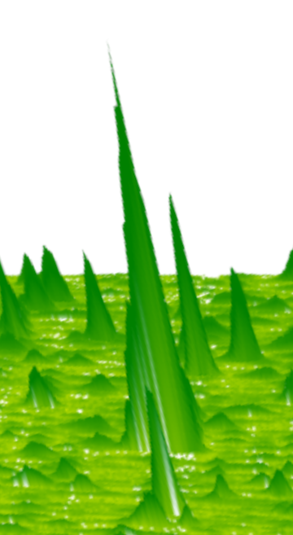{.element fig-pos="H" fig-align="center"}


<!-- %%%%%%%%%%%%%%%%%%%%%%%%%%%%%%%%%%%%%%%%%%%%%%%%%%%%%%%%%%%%%%%%%%%% -->


## Spectral counting Vs Intensity calculation {auto-animate="true"}

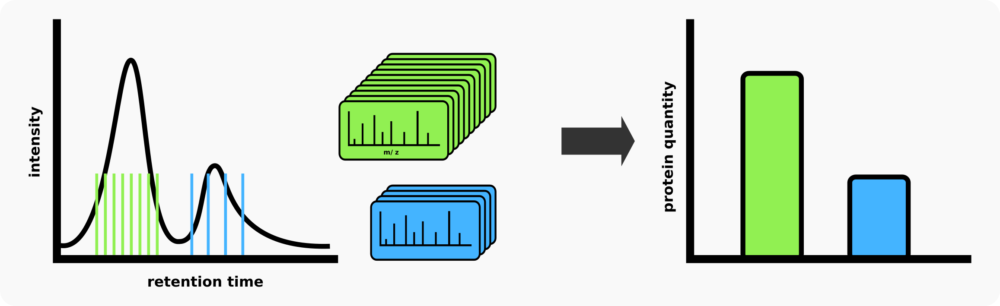{fig-align="center" width="70%"}

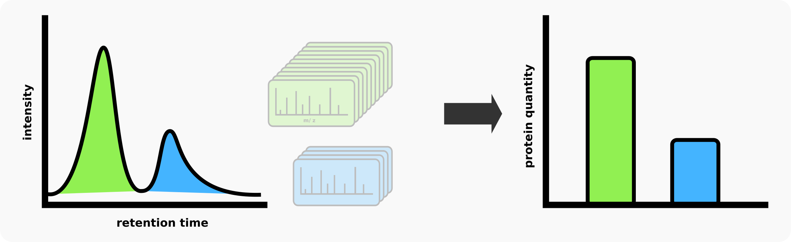{fig-align="center" width="40%"}


## Spectral counting Vs Intensity calculation {auto-animate="true"}

{fig-pos="H" fig-align="center" width="40%"}

{fig-pos="H" fig-align="center" width="70%"}

<!-- %%%%%%%%%%%%%%%%%%%%%%%%%%%%%%%%%%%%%%%%%%%%%%%%%%%%%%%%%%%%%%%%%%%% -->

## Search engine {auto-animate="true"}

::: columns
::: {.column width="40%"}
Commonly we use **MaxQuant** or **DiaNN** platforms for spectra identification.\
\

::: fragment
Tons of alternatives:
:::

> -   FragPipe
> -   ProteomeDiscoverer
> -   PEAKS
> -   Mascot
> -   Skyline
> -   Spectronaut
> -   Progenesis
:::

::: {.column width="60%"}
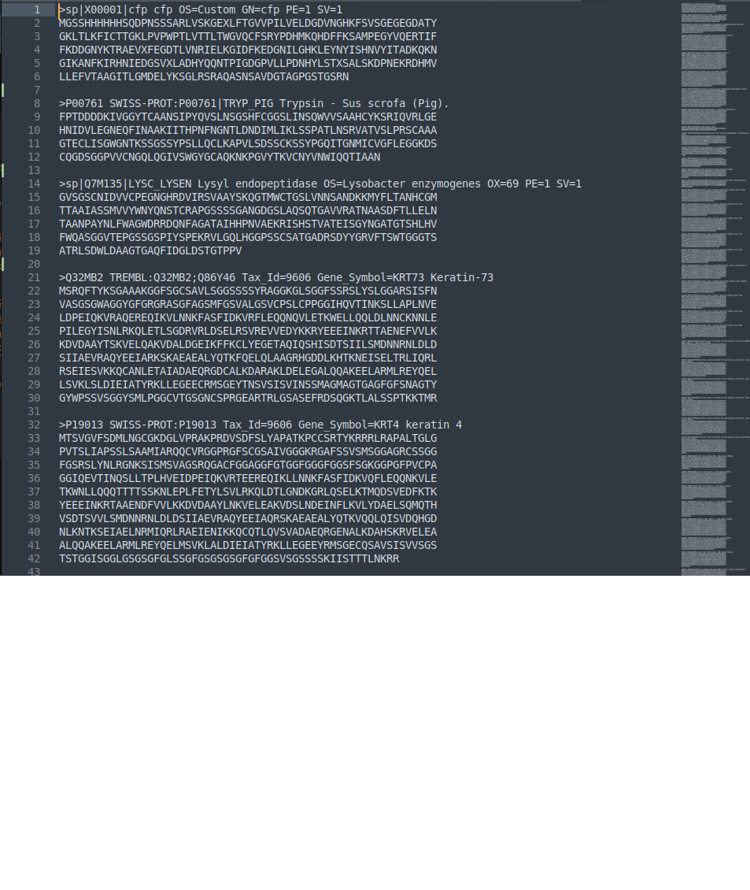{.element fig-pos="H" fig-align="center" height="50%" width="90%"}
:::
:::

<!-- %%%%%%%%%%%%%%%%%%%%%%%%%%%%%%%%%%%%%%%%%%%%%%%%%%%%%%%%%%%%%%%%%%%% -->

## Big data analysis {auto-animate="true"}

-   scaffold file (4 samples)

{fig-align="left" width="40%"}

-   big data report (20 samples)

{fig-align="left" width="40%"}

-   takes 5 minutes to open it in you favorite MS Excel like software

-   table contains **606934** rows

<!-- %%%%%%%%%%%%%%%%%%%%%%%%%%%%%%%%%%%%%%%%%%%%%%%%%%%%%%%%%%%%%%%%%%%% -->

## Use programming {auto-animate="true"}

Our go-to is: R is a language and environment for statistical computing and graphics:

::: incremental
-   provides a wide variety of statistical techniques

    ::: incremental
    -   linear and nonlinear modelling
    -   classical statistical tests
    -   time-series analysis
    -   classification
    -   clustering
    :::
:::

## Use programming {auto-animate="true"}

Our go-to is: R, a language and environment for statistical computing and graphics:

-   provides a wide variety of statistical techniques

-   beautiful graphical output

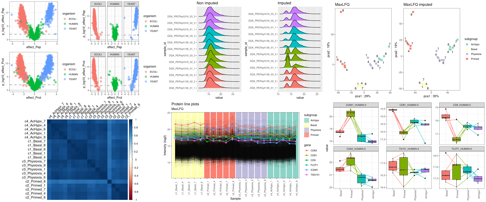{fig-align="center"}

## Use programming {auto-animate="true"}

Our go-to is: R is a language and environment for statistical computing and graphics:

-   provides a wide variety of statistical techniques

-   beautiful graphical output

-   highly extensible

{fig-align="center"}

## Use programming {auto-animate="true"}

This presentation is also written in coding language called **Quarto**, using **reveal. js**,an open source HTML presentation framework

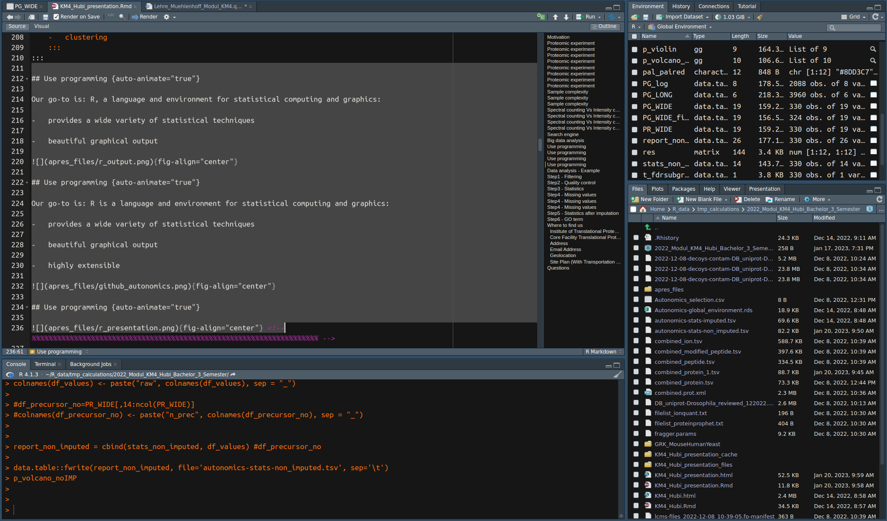{fig-align="center" width="100%"}

<!-- %%%%%%%%%%%%%%%%%%%%%%%%%%%%%%%%%%%%%%%%%%%%%%%%%%%%%%%%%%%%%%%%%%%% -->

## Data analysis - Example {auto-animate="true"}

::: columns
::: {.column width="50%"}
::: fragment
Experimental design:
:::

::: incremental
-   20 samples
-   4 conditions
-   5 replicates per condition
-   EV (extracellular vesicles) enrichment
:::
:::

::: {.column width="50%"}
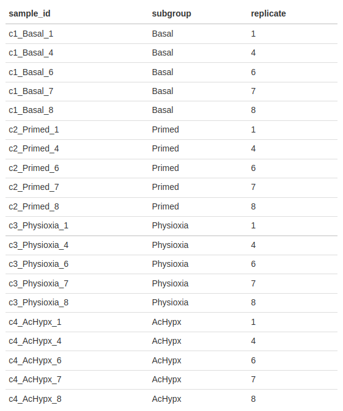{fig-align="center"}
:::
:::

<!-- %%%%%%%%%%%%%%%%%%%%%%%%%%%%%%%%%%%%%%%%%%%%%%%%%%%%%%%%%%%%%%%%%%%% -->

## Step1 - Filtering {auto-animate="true"}

::: fragment
Similar to the Scaffold workflow:
:::

::: incremental
-   protein and peptide matching FDR already filtered to 1% at the **search engine** level
-   additional filtering of the data
:::

::: columns
::: {.column width="70%"}
::: fragment

```{r , eval=F }
#| code-line-numbers: true
#| code-block-border-left: true
#| code-block-bg: true

Loading required package: data.table
                                             Filter    n
                                                    5350
                                      Reverse == "" 5350
                      `Potential contaminant` == "" 5251
expr > 0, for at least two samples in some subgroup 5210
```
:::

:::
:::

::: fragment
Spectra identification software identified 5350 protein groups. After dropping 99 potential contaminants, 41 without replication (within subgroup), 5210 proteingroups were retained for further analysis.
:::

<!-- %%%%%%%%%%%%%%%%%%%%%%%%%%%%%%%%%%%%%%%%%%%%%%%%%%%%%%%%%%%%%%%%%%%% -->
## Step2 - Quality control {.nostretch auto-animate="true"}

## Step2 - QC - PCA {.nostretch auto-animate="true"}

::: columns
::: {.column width="40%"}
```{r, eval=F , stretch=TRUE}
pal_paired = brewer.pal(12, "Set3")

biplot(pca(object,
   assay = (object)[1]), 
   shape = NULL,
   label = "replicate",
   palette = pal_paired)+ 
   ggtitle("log2.MaxLFQ")


```
:::
::: {.column width="60%"}
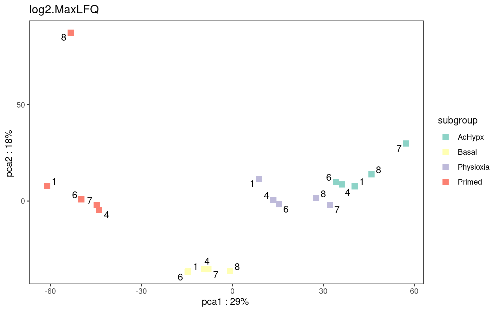{.fragment fig-align="center"}
:::
:::

## Step2 - QC - profile plots { auto-animate="true"}

::: columns
::: {.column width="40%"}
```{r, eval=F , stretch=TRUE}
#| code-line-numbers: "|3-4|7-10|11-15|16-20"
ggplot(
  data=PG_log_org, 
  aes(x=Sample, 
      y=PG.MaxLFQ, 
      group=gene)) +
  theme_lineplot+
  labs(
    title="Protein line plots", 
    subtitle="MaxLFQ",  
    y = "Intensity (log2)")+
  geom_point(
    data=subset(t_sel), 
    size=2, 
    aes(color=gene),
    alpha = 0.9)+
  geom_line(
    data=subset(t_sel), 
    size=1,
    aes(color=gene),
    alpha = 0.7)


```
:::
::: {.column width="60%"}
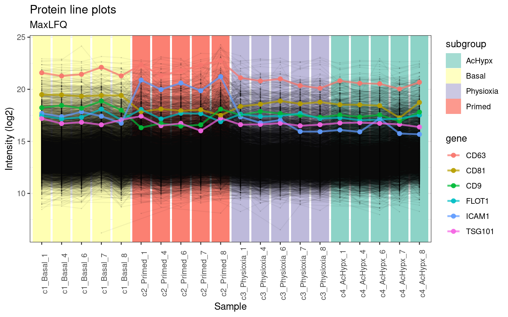{ fig-align="center"}
:::
:::

## Step2 - QC - profile plots { auto-animate="true"}

::: columns
::: {.column width="40%"}
```{r, eval=F , stretch=TRUE}
#| code-line-numbers: "16-20"
ggplot(
  data=PG_log_org, 
  aes(x=Sample, 
      y=PG.MaxLFQ, 
      group=gene)) +
  theme_lineplot+
  labs(
    title="Protein line plots", 
    subtitle="MaxLFQ",  
    y = "Intensity (log2)")+
  geom_point(
    data=subset(t_sel), 
    size=2, 
    aes(color=gene),
    alpha = 0.9)+
  geom_line(
    data=subset(t_sel), 
    size=3,
    aes(color=gene),
    alpha = 0.7)


```
:::
::: {.column width="60%"}
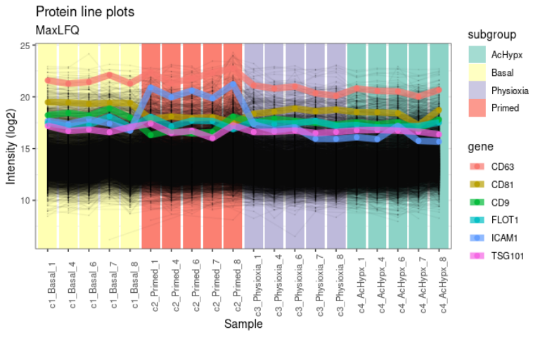{ fig-align="center" width="100%"}
:::
:::

## Step2 - QC - Correlation matrix { auto-animate="true"}

::: columns
::: {.column width="40%"}
```{r, eval=F, stretch=TRUE }
t_int=df_wide[,11:ncol(df_wide)]
res <- cor(
  t_int, 
  use="complete.obs", 
  method = c("pearson"))
corrplot(
  res, 
  type = "full", 
  order = "hclust", 
  method = 'color', 
  tl.col = "black", 
  tl.srt = 45)

```
:::
::: {.column width="60%"}
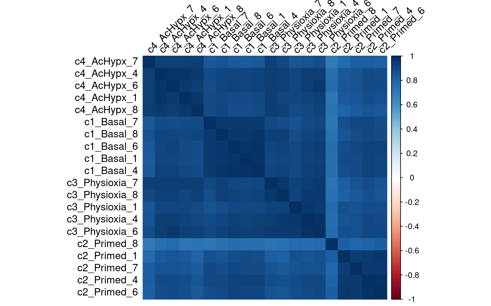{fig-align="center" width="100%"}
:::
:::

## Step2 - QC - Number of identified proteins {.stretch auto-animate="true"}

::: columns
::: {.column width="40%"}
```{r, eval=F}
#| code-overflow: wrap
#| 
ggplot(
  data=PG_log_org, 
  aes(Sample)) + 
  labs(
    title="Number of identified 
           protein groups")+
  geom_bar(aes(fill=subgroup))+
  ylim(0,max(
    table(PG_log_org$Sample)
    )*1.3 )+
  geom_text(
    stat='count', 
    aes(label=..count..), 
    hjust=-0.2)+
  theme_bw()  + 
  theme(
    axis.text.x = 
      element_text(angle = 90)
    ) +
  theme(legend.position = "none")+ 
  coord_flip()

```

:::
::: {.column width="60%"}
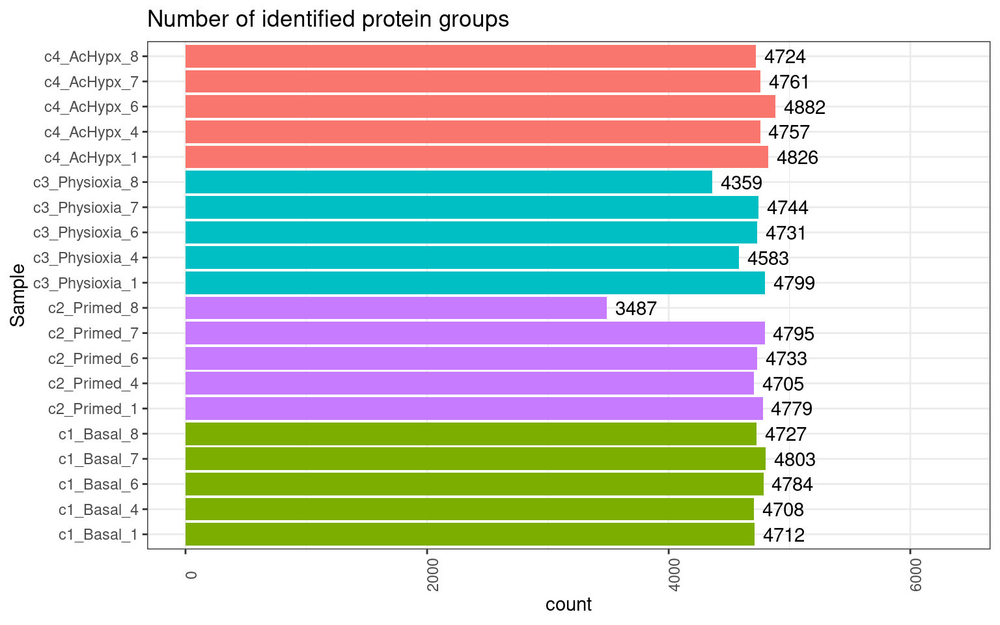{fig-align="center"}
:::
:::
  
## Step2 - QC - Number of identified proteins {.stretch auto-animate="true"}

::: columns
::: {.column width="40%"}
```{r, eval=F}
#| code-overflow: wrap

plot_sample_violins(object)+ 
  theme(legend.position="none")
```

:::
::: {.column width="60%"}
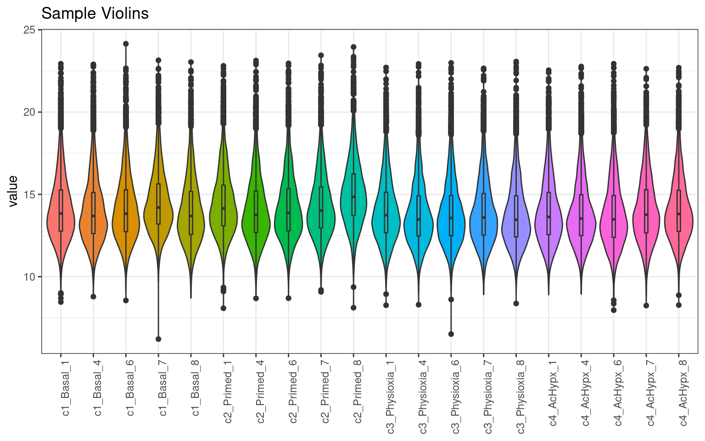{fig-align="center"}
:::
:::


<!-- %%%%%%%%%%%%%%%%%%%%%%%%%%%%%%%%%%%%%%%%%%%%%%%%%%%%%%%%%%%%%%%%%%%% -->

## Step3 - Statistics {auto-animate="true"}

**Differential Expression Analysis** quantifies whether condition differences are significant.

**pvalue** is a probability that the difference between groups arose due to random sampling.

::: columns
::: {.column width="40%"}

```{r, eval=F}
#| code-overflow: wrap

contrastdefs <- c('Primed - Basal',
                  'Physioxia - Basal',
                  'AcHypx - Basal')

design  <- create_design(
  object, 
  formula = ~ 0 + subgroup, 
  drop = TRUE)
object %<>% fit_limma(
  design = design, 
  contrasts = contrastdefs)

plot_volcano(
  object, 
  coefs = contrastdefs,  
  max.overlaps = 10, 
  label = 'cleanprotein', 
  features = df_selection, 
  nrow=1, 
  size = "log2.MaxLFQ", 
  xlabel = -5) + 
  ggtitle("Volcano plot")
```
:::
::: {.column width="60%"}
::: r-stack
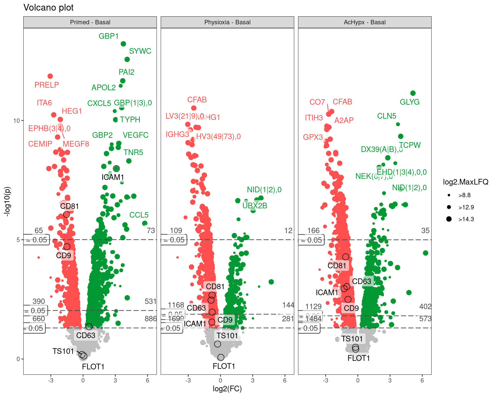{fig-align="center" width="80%"}
:::
:::
:::

<!-- %%%%%%%%%%%%%%%%%%%%%%%%%%%%%%%%%%%%%%%%%%%%%%%%%%%%%%%%%%%%%%%%%%%% -->

## Step3 - Expression profiles {auto-animate="true"}

**Differential Expression Analysis** quantifies whether condition differences are significant.

**pvalue** is a probability that the difference between groups arose due to random sampling.

::: columns
::: {.column width="40%"}

```{r, eval=F}
#| code-overflow: wrap

object$subgroup %<>% factor(unique(.))
plot_exprs(
  object_exprs[df_selection, ], 
  block = 'replicate', n=Inf,
  facet='feature_id')+
  ggtitle(NULL)+
  theme(legend.position = "none")

```
:::
::: {.column width="60%"}
::: r-stack
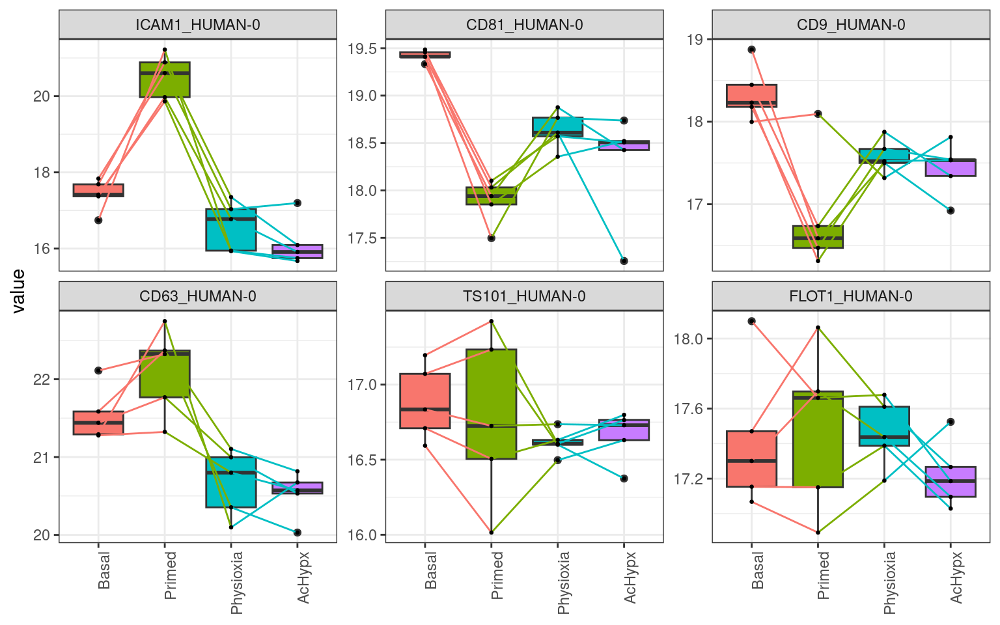{fig-align="center"}
:::
:::
:::

<!-- %%%%%%%%%%%%%%%%%%%%%%%%%%%%%%%%%%%%%%%%%%%%%%%%%%%%%%%%%%%%%%%%%%%% -->

## Step4 - Missing values {auto-animate="true"}

::: r-stack
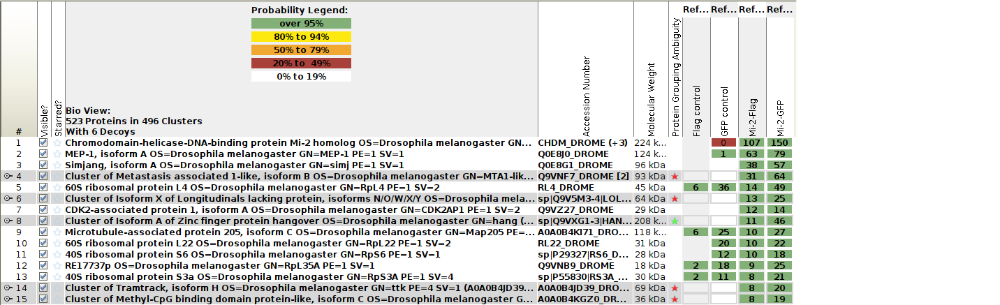{.fragment .fade-in-then-out fig-align="center" width="100%"}

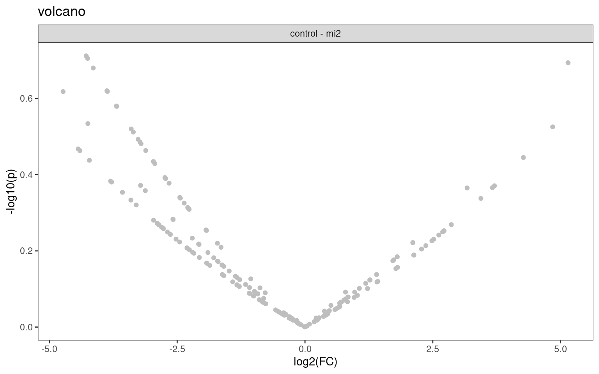{.fragment .fade-in-then-out fig-align="center" width="80%"}

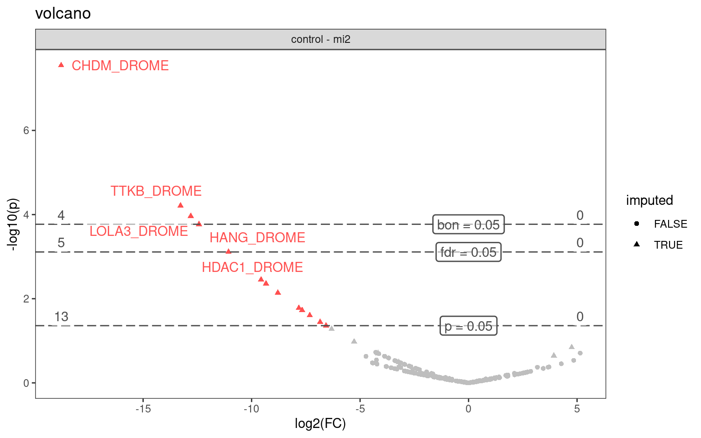{.fragment .fade-in-then-out fig-align="center" width="80%"}

:::

<!-- %%%%%%%%%%%%%%%%%%%%%%%%%%%%%%%%%%%%%%%%%%%%%%%%%%%%%%%%%%%%%%%%%%%% -->

## Importance of replication {auto-animate="true"}

::: r-stack
{.fade-in-then-out fig-align="center" width="100%"}

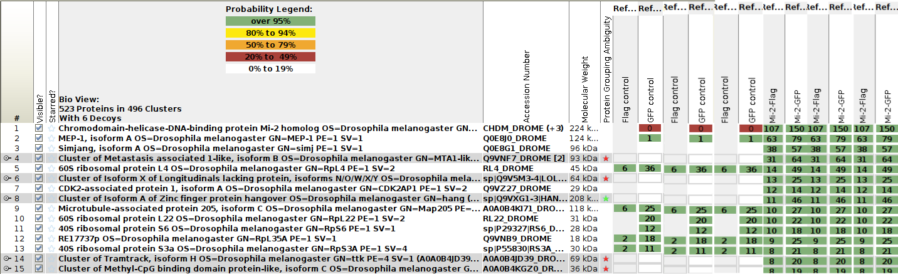{.fragment .fade-in-then-out fig-align="center" width="100%"}
:::

## Step4 - Missing values {auto-animate="true"}

There are two types of NAs:

**systematic NAs**: missing completely in some subgroups but detected in others (for at least half of the samples). These represent potential switch-like responses.

**random NAs**. They are missing in some samples, but the "missingness" is unrelated to subgroup. These samples do not require require imputation for statistical analysis to return pvalues.

\

::: fragment
In this dataset:

-   **422** proteingroups have **systematic NAs**

-   **2024** proteingroups have **random NAs**

-   **2764** proteingroups have **no NAs**
:::

## Step4 - Missing values {auto-animate="true"}

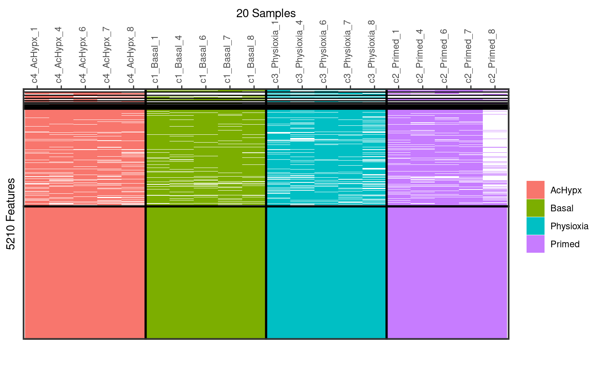{fig-align="center" width="100%"}

<!-- %%%%%%%%%%%%%%%%%%%%%%%%%%%%%%%%%%%%%%%%%%%%%%%%%%%%%%%%%%%%%%%%%%%% -->

## Step5 - Statistics after imputation {auto-animate="true"}

::: r-stack
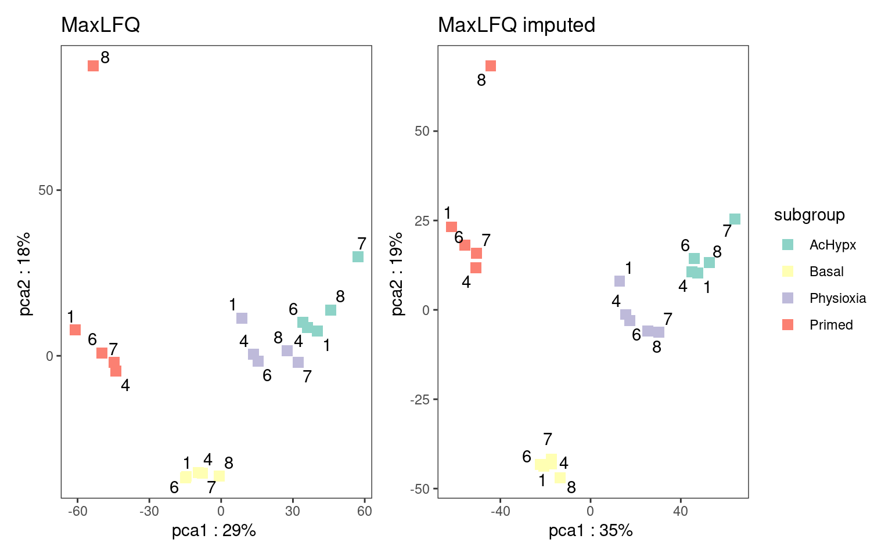{.fragment .fade-in-then-out fig-align="center" width="80%"}

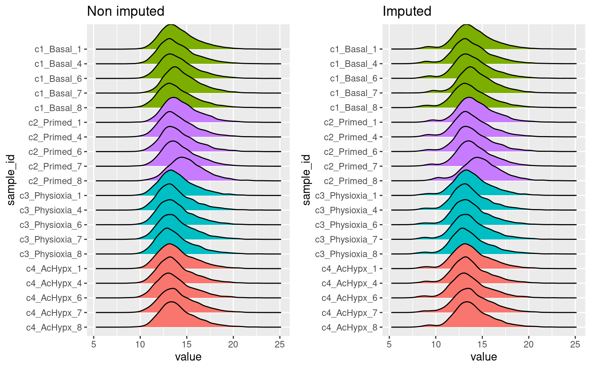{.fragment .fade-in-then-out fig-align="center" width="80%"}

{.fragment .fade-in-then-out fig-align="center" width="60%"}

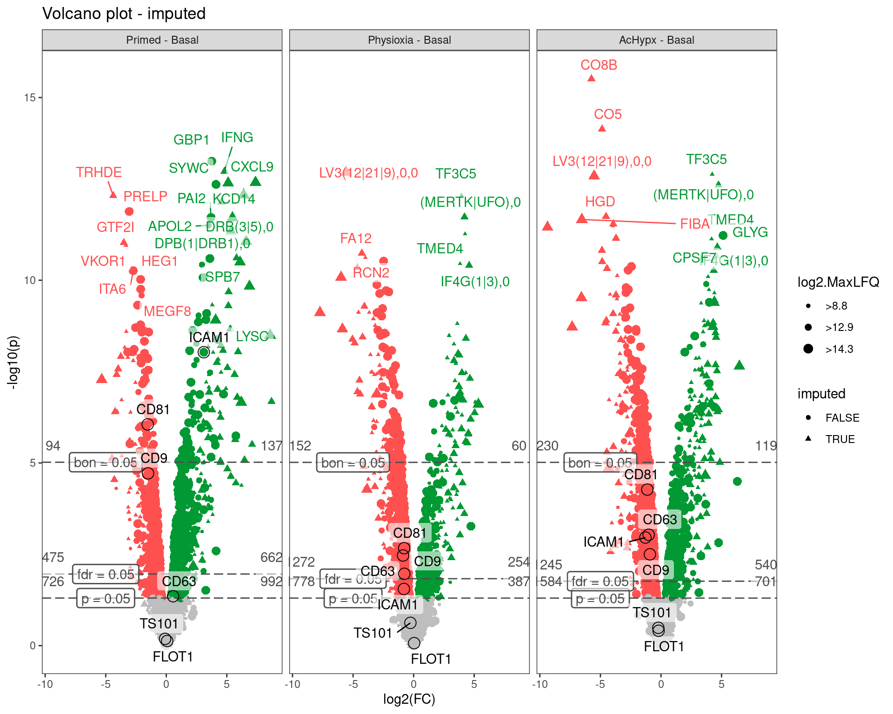{.fragment .fade-in-then-out fig-align="center" width="60%"}
:::

<!-- %%%%%%%%%%%%%%%%%%%%%%%%%%%%%%%%%%%%%%%%%%%%%%%%%%%%%%%%%%%%%%%%%%%% -->

## Step6 - GO term {auto-animate="true"}

GO stands for **Gene Ontology** and as the name suggests, it annotates genes using an ontology. It is a major bioinformatics initiative to unify the representation of gene and gene product attributes across all species.

::: r-stack
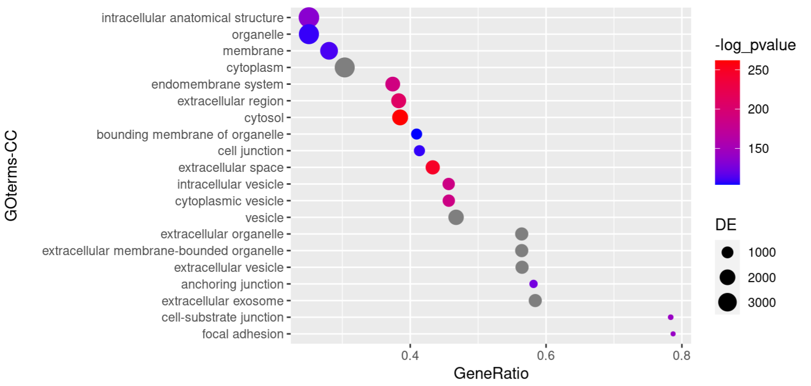{.fragment .fade-in-then-out fig-align="center" width="80%"}

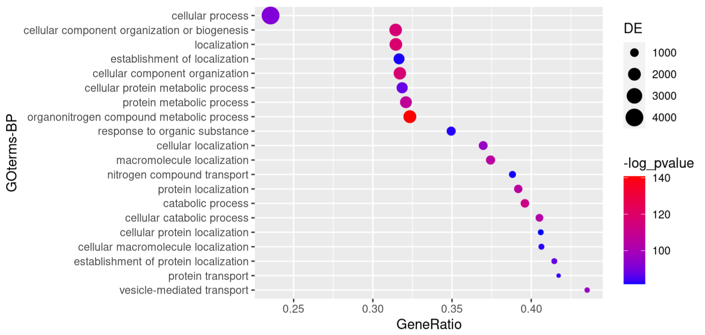{.fragment .fade-in-then-out fig-align="center" width="80%"}

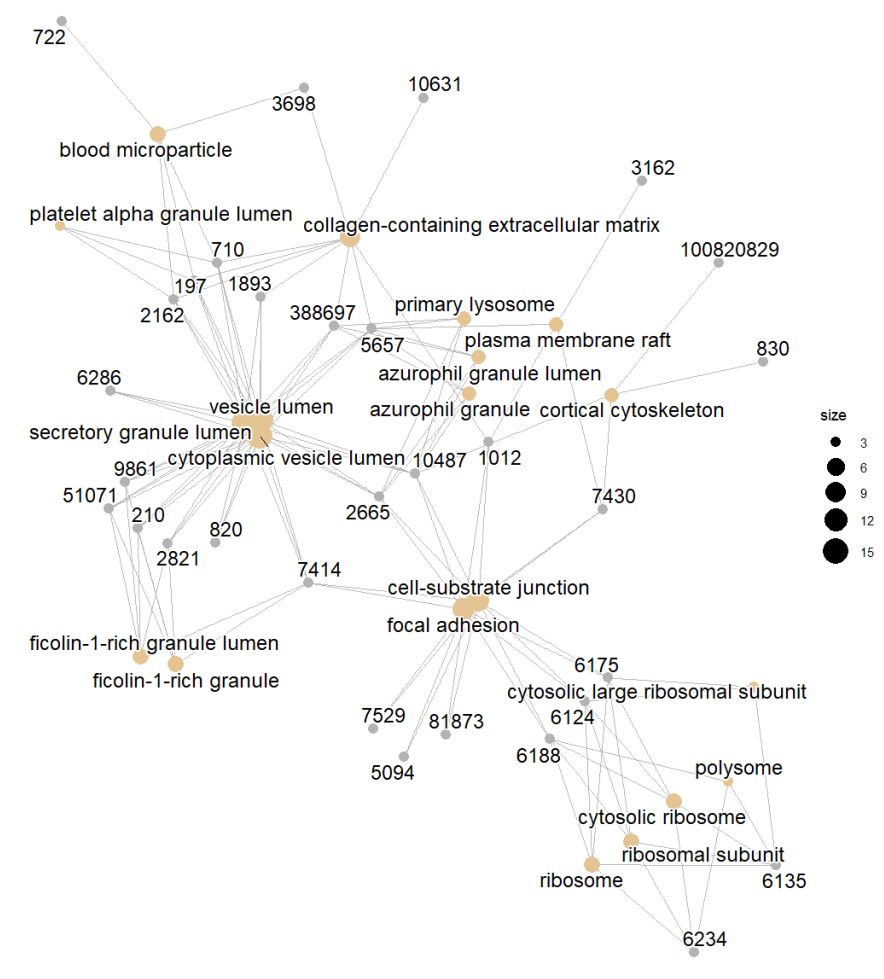{.fragment .fade-in-then-out fig-align="center" width="50%"}
:::

<!-- %%%%%%%%%%%%%%%%%%%%%%%%%%%%%%%%%%%%%%%%%%%%%%%%%%%%%%%%%%%%%%%%%%%% -->

## Conclusions {auto-animate="true"}

::: fragment
### Learn coding language :) 
:::

\

::: fragment
### Thanks for the attention! 
:::


<!-- %%%%%%%%%%%%%%%%%%%%%%%%%%%%%%%%%%%%%%%%%%%%%%%%%%%%%%%%%%%%%%%%%%%% -->

## Conclusions {auto-animate="true"}


{fig-align="center" width="100%"}

<!-- %%%%%%%%%%%%%%%%%%%%%%%%%%%%%%%%%%%%%%%%%%%%%%%%%%%%%%%%%%%%%%%%%%%% -->

## Conclusions {auto-animate="true"}


```{r, eval=F}
#| code-overflow: wrap

[<start> idea]-:> [<phospho>experimental design]
[<phospho>
    experimental design | sample origin |  
    quantification strategy |correct  controls|number of replicates] 
    -:> [<condb>sample preparation]
[<condb>
    sample preparation | lysis | digestion | fractionation  | purification | enrichment ] 
    -:> [<boxa>chromatography]
[<boxa>
    chromatography | gradient length | column | elution profile]  
-:> [<boxb>mass spectrometry]


[<table> mass spectrometry] 
  -:> [<conda>spectra identification]

[<conda>spectra identification] 
  -:> [<boxd>data analysis ]

[<start> idea] 
  <-- [<boxd>data analysis]

[<table> mass spectrometry] 
  -:> [<boxc>
         instrument settings | resolution | mass range | mass accuracy | speed | ionization energy | fragmentation method]
[<table> mass spectrometry] 
  -:> [<table>acquisition mode | resolution | mass range | mass accuracy | speed | ionization energy | fragmentation method]
[<boxc>acquisition mode] 
  <--> [<boxc>instrument settings]

```

<!-- %%%%%%%%%%%%%%%%%%%%%%%%%%%%%%%%%%%%%%%%%%%%%%%%%%%%%%%%%%%%%%%%%%%% -->

## Where to find us

#### Institute of Translational Proteomics

#### Core Facility Translational Proteomics

::: columns
::: {.column width="60%"}
#### Address

Philipps--University Marburg\
Department of Medicine\
Biochemical/Pharmacological Centre, Building K\|03\
Karl--von--Frisch--Straße 2\
35043 Marburg\
GERMANY

#### Email Address

[translational.proteomics\@...](mailto:translational.proteomics@uni-marburg.de)

#### Geolocation

50.8044, 8.80745
:::

::: {.column width="40%"}
#### Site Plan (With Transportation Options)

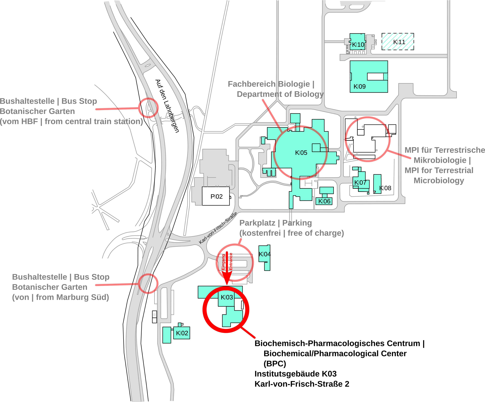{.lightbox description="Map of the lab's location including transport options."}
:::
:::

<!-- %%%%%%%%%%%%%%%%%%%%%%%%%%%%%%%%%%%%%%%%%%%%%%%%%%%%%%%%%%%%%%%%%%%% -->

## Questions

-   what is needed in order to allow for statistical test? (replication)
-   what are different ways to quantify proteins analyzed by mass spectrometry? (spectral counts, area of peak elution)
-   what are two types of missing values (systematic and random)
